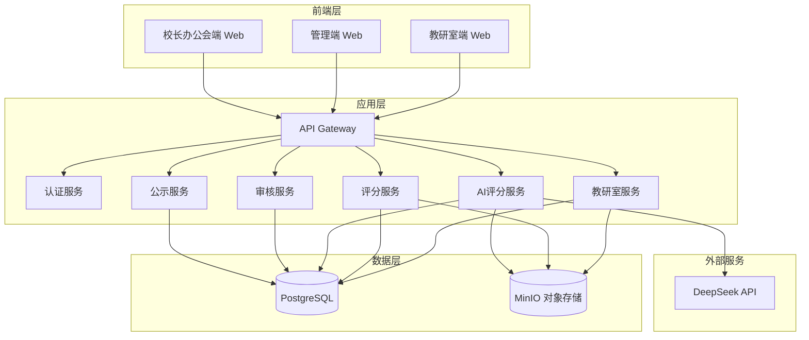
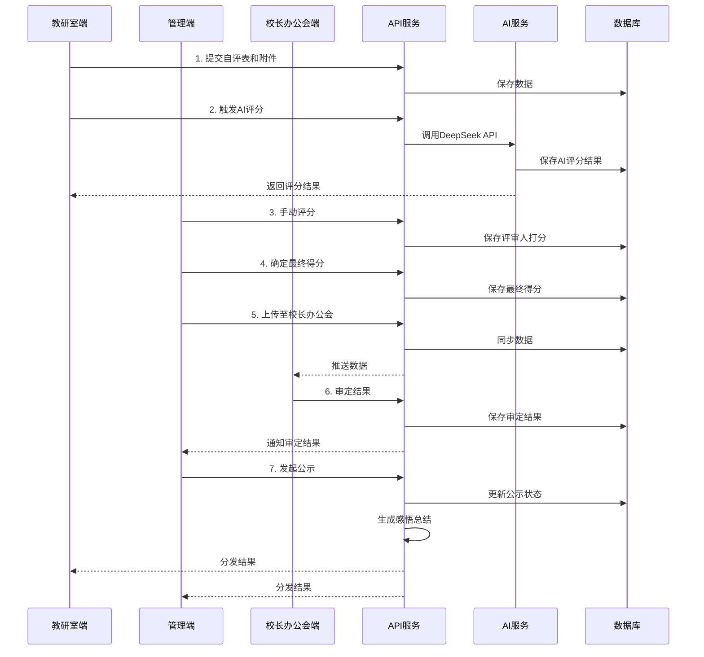

# 设计文档 - 教研室工作考评系统

## 概述

教研室工作考评系统是一个三端分离的Web应用系统，实现教研室自评、AI自动评分、管理端审核、校长办公会审定、结果公示与分发的全流程数字化管理。

### 系统目标

- 实现考评流程标准化和自动化
- 提供透明的评分追溯机制
- 支持多角色协同工作
- 确保数据安全和完整性

### 技术栈

- **前端**: Vue 3 + TypeScript + Element Plus
- **后端**: FastAPI + Python + SQLAlchemy
- **数据库**: PostgreSQL (关系型数据) + MinIO (附件存储)
- **AI服务**: DeepSeek API
- **通信协议**: HTTPS + RESTful API
- **认证**: JWT Token

## 架构

### 系统架构

系统采用前后端分离的三层架构：



### 数据流



## 组件和接口

### 1. 教研室服务 (Teaching Office Service)

负责教研室端的自评表填写、附件上传、结果查看功能。

#### 接口

```typescript
// 保存自评表
POST /api/teaching-office/self-evaluation
Request: {
  teachingOfficeId: string;
  evaluationYear: number;
  content: {
    teachingProcessManagement: string;
    courseConstruction: string;
    teachingReformProjects: number;
    honoraryAwards: number;
    // ... 其他自评内容
  };
}
Response: {
  evaluationId: string;
  status: 'draft' | 'submitted';
  createdAt: string;
}

// 上传附件
POST /api/teaching-office/attachments
Request: FormData {
  evaluationId: string;
  indicator: string; // 考核指标
  files: File[];
}
Response: {
  attachmentIds: string[];
  uploadedCount: number;
}

// 触发AI评分
POST /api/teaching-office/trigger-ai-scoring
Request: {
  evaluationId: string;
}
Response: {
  scoringTaskId: string;
  status: 'processing';
}

// 查看结果
GET /api/teaching-office/result/{evaluationId}
Response: {
  finalScore: number;
  scoringDetails: ScoringDetail[];
  insightSummary: string;
  publicationDate: string;
}
```

### 2. AI评分服务 (AI Scoring Service)

负责调用DeepSeek API进行自动评分、异常检测、附件分类。

#### 接口

```typescript
// 内部接口：执行AI评分
async function executeAIScoring(evaluationId: string): Promise<AIScore> {
  // 1. 获取自评表和附件
  const evaluation = await getEvaluation(evaluationId);
  const attachments = await getAttachments(evaluationId);
  
  // 2. 调用DeepSeek API
  const prompt = buildScoringPrompt(evaluation, attachments);
  const aiResponse = await callDeepSeekAPI(prompt);
  
  // 3. 解析AI响应
  const score = parseAIResponse(aiResponse);
  
  // 4. 检测异常
  const anomalies = detectAnomalies(evaluation, score);
  
  // 5. 分类附件
  const classifiedAttachments = classifyAttachments(attachments, score);
  
  // 6. 保存结果
  await saveAIScore(evaluationId, score, anomalies, classifiedAttachments);
  
  return score;
}

// DeepSeek API调用
async function callDeepSeekAPI(prompt: string): Promise<string> {
  const response = await fetch('https://api.deepseek.com/v1/chat/completions', {
    method: 'POST',
    headers: {
      'Authorization': `Bearer ${DEEPSEEK_API_KEY}`,
      'Content-Type': 'application/json'
    },
    body: JSON.stringify({
      model: 'deepseek-chat',
      messages: [
        { role: 'system', content: '你是教研室工作考评专家...' },
        { role: 'user', content: prompt }
      ],
      temperature: 0.3
    })
  });
  return response.json();
}

// 异常检测
function detectAnomalies(
  evaluation: Evaluation, 
  aiScore: AIScore
): Anomaly[] {
  const anomalies: Anomaly[] = [];
  
  // 检测教学改革项目数量不一致
  if (evaluation.content.teachingReformProjects !== aiScore.parsedReformProjects) {
    anomalies.push({
      type: 'count_mismatch',
      indicator: 'teaching_reform_projects',
      declaredCount: evaluation.content.teachingReformProjects,
      parsedCount: aiScore.parsedReformProjects,
      description: `自评表填写${evaluation.content.teachingReformProjects}项教学改革项目，附件仅解析出${aiScore.parsedReformProjects}份证书`
    });
  }
  
  // 检测荣誉表彰数量不一致
  if (evaluation.content.honoraryAwards !== aiScore.parsedHonoraryAwards) {
    anomalies.push({
      type: 'count_mismatch',
      indicator: 'honorary_awards',
      declaredCount: evaluation.content.honoraryAwards,
      parsedCount: aiScore.parsedHonoraryAwards,
      description: `自评表填写${evaluation.content.honoraryAwards}项荣誉表彰，附件仅解析出${aiScore.parsedHonoraryAwards}份证书`
    });
  }
  
  return anomalies;
}
```

### 3. 评分服务 (Scoring Service)

负责管理端的手动评分、最终得分确定。

#### 接口

```typescript
// 提交手动评分
POST /api/scoring/manual-score
Request: {
  evaluationId: string;
  reviewerId: string;
  reviewerRole: 'evaluation_team' | 'evaluation_office';
  scores: {
    indicator: string;
    score: number;
    comment: string;
  }[];
}
Response: {
  scoreRecordId: string;
  submittedAt: string;
}

// 确定最终得分
POST /api/scoring/final-score
Request: {
  evaluationId: string;
  finalScore: number;
  summary: string;
}
Response: {
  finalScoreId: string;
  status: 'finalized';
}

// 查看所有评审人打分
GET /api/scoring/all-scores/{evaluationId}
Response: {
  aiScore: AIScore;
  manualScores: ManualScore[];
  finalScore: FinalScore;
}
```

### 4. 审核服务 (Review Service)

负责异常处理、数据同步、审定操作。

#### 接口

```typescript
// 处理异常数据
POST /api/review/handle-anomaly
Request: {
  evaluationId: string;
  anomalyId: string;
  action: 'reject' | 'correct';
  correctedData?: any;
  rejectReason?: string;
}
Response: {
  status: 'handled';
  handledAt: string;
}

// 上传至校长办公会
POST /api/review/sync-to-president-office
Request: {
  evaluationIds: string[];
}
Response: {
  syncTaskId: string;
  status: 'syncing';
}

// 审定结果
POST /api/review/approve
Request: {
  evaluationIds: string[];
  decision: 'approve' | 'reject';
  rejectReason?: string;
}
Response: {
  approvalId: string;
  approvedAt: string;
}
```

### 5. 公示服务 (Publication Service)

负责公示操作、结果分发、感悟生成。

#### 接口

```typescript
// 发起公示
POST /api/publication/publish
Request: {
  evaluationIds: string[];
}
Response: {
  publicationId: string;
  publishedAt: string;
}

// 生成感悟总结
async function generateInsightSummary(evaluationId: string): Promise<string> {
  const evaluation = await getEvaluation(evaluationId);
  const scores = await getAllScores(evaluationId);
  
  // 分析得分情况
  const analysis = analyzeScores(scores);
  
  // 生成总结
  const summary = `该教研室在${analysis.strongIndicators.join('、')}等指标表现突出，得分较高。` +
    `但在${analysis.weakIndicators.join('、')}等方面有待提升。` +
    `建议加强${analysis.suggestions.join('、')}等工作。`;
  
  return summary;
}

// 分发结果
POST /api/publication/distribute
Request: {
  publicationId: string;
}
Response: {
  distributedCount: number;
  distributedAt: string;
}
```

### 6. 认证服务 (Authentication Service)

负责用户认证和权限管理。

#### 接口

```typescript
// 登录
POST /api/auth/login
Request: {
  username: string;
  password: string;
  role: 'teaching_office' | 'management' | 'president_office';
}
Response: {
  token: string;
  userId: string;
  role: string;
  expiresIn: number;
}

// 验证Token
GET /api/auth/verify
Headers: {
  Authorization: 'Bearer {token}'
}
Response: {
  valid: boolean;
  userId: string;
  role: string;
}
```

## 数据模型

### 核心实体

```typescript
// 教研室
interface TeachingOffice {
  id: string;
  name: string;
  code: string;
  department: string;
  createdAt: Date;
  updatedAt: Date;
}

// 自评表
interface SelfEvaluation {
  id: string;
  teachingOfficeId: string;
  evaluationYear: number;
  content: {
    teachingProcessManagement: string;
    courseConstruction: string;
    teachingReformProjects: number;
    honoraryAwards: number;
    // ... 其他自评内容
  };
  status: 'draft' | 'submitted' | 'locked' | 'ai_scored' | 'manually_scored' | 'finalized' | 'published';
  submittedAt?: Date;
  createdAt: Date;
  updatedAt: Date;
}

// 附件
interface Attachment {
  id: string;
  evaluationId: string;
  indicator: string; // 考核指标
  fileName: string;
  fileSize: number;
  fileType: string;
  storagePath: string;
  classifiedBy: 'user' | 'ai';
  uploadedAt: Date;
}

// AI评分结果
interface AIScore {
  id: string;
  evaluationId: string;
  totalScore: number;
  indicatorScores: {
    indicator: string;
    score: number;
    reasoning: string;
  }[];
  parsedReformProjects: number;
  parsedHonoraryAwards: number;
  anomalies: Anomaly[];
  scoredAt: Date;
}

// 异常数据
interface Anomaly {
  id: string;
  evaluationId: string;
  type: 'count_mismatch' | 'missing_attachment' | 'invalid_data';
  indicator: string;
  declaredCount?: number;
  parsedCount?: number;
  description: string;
  status: 'pending' | 'handled';
  handledBy?: string;
  handledAction?: 'reject' | 'correct';
  handledAt?: Date;
}

// 手动评分记录
interface ManualScore {
  id: string;
  evaluationId: string;
  reviewerId: string;
  reviewerName: string;
  reviewerRole: 'evaluation_team' | 'evaluation_office';
  weight: number; // 权重
  scores: {
    indicator: string;
    score: number;
    comment: string;
  }[];
  submittedAt: Date;
}

// 最终得分
interface FinalScore {
  id: string;
  evaluationId: string;
  finalScore: number;
  summary: string;
  determinedBy: string;
  determinedAt: Date;
}

// 审定记录
interface Approval {
  id: string;
  evaluationIds: string[];
  decision: 'approve' | 'reject';
  rejectReason?: string;
  approvedBy: string;
  approvedAt: Date;
}

// 公示记录
interface Publication {
  id: string;
  evaluationIds: string[];
  publishedBy: string;
  publishedAt: Date;
  distributedAt?: Date;
}

// 感悟总结
interface InsightSummary {
  id: string;
  evaluationId: string;
  summary: string;
  generatedAt: Date;
}

// 操作日志
interface OperationLog {
  id: string;
  operationType: 'submit' | 'ai_score' | 'manual_score' | 'handle_anomaly' | 'sync' | 'approve' | 'publish' | 'distribute';
  operatorId: string;
  operatorName: string;
  operatorRole: string;
  targetId: string; // 操作对象ID
  targetType: string; // 操作对象类型
  details: any;
  operatedAt: Date;
}

// 用户
interface User {
  id: string;
  username: string;
  passwordHash: string;
  role: 'teaching_office' | 'evaluation_team' | 'evaluation_office' | 'president_office';
  teachingOfficeId?: string; // 如果是教研室用户
  name: string;
  email: string;
  createdAt: Date;
  updatedAt: Date;
}
```

### 数据库表设计

```sql
-- 教研室表
CREATE TABLE teaching_offices (
  id UUID PRIMARY KEY DEFAULT gen_random_uuid(),
  name VARCHAR(255) NOT NULL,
  code VARCHAR(50) UNIQUE NOT NULL,
  department VARCHAR(255),
  created_at TIMESTAMP DEFAULT CURRENT_TIMESTAMP,
  updated_at TIMESTAMP DEFAULT CURRENT_TIMESTAMP
);

-- 自评表
CREATE TABLE self_evaluations (
  id UUID PRIMARY KEY DEFAULT gen_random_uuid(),
  teaching_office_id UUID NOT NULL REFERENCES teaching_offices(id),
  evaluation_year INTEGER NOT NULL,
  content JSONB NOT NULL,
  status VARCHAR(50) NOT NULL,
  submitted_at TIMESTAMP,
  created_at TIMESTAMP DEFAULT CURRENT_TIMESTAMP,
  updated_at TIMESTAMP DEFAULT CURRENT_TIMESTAMP,
  UNIQUE(teaching_office_id, evaluation_year)
);

-- 附件表
CREATE TABLE attachments (
  id UUID PRIMARY KEY DEFAULT gen_random_uuid(),
  evaluation_id UUID NOT NULL REFERENCES self_evaluations(id),
  indicator VARCHAR(255) NOT NULL,
  file_name VARCHAR(255) NOT NULL,
  file_size BIGINT NOT NULL,
  file_type VARCHAR(100),
  storage_path VARCHAR(500) NOT NULL,
  classified_by VARCHAR(20) NOT NULL,
  uploaded_at TIMESTAMP DEFAULT CURRENT_TIMESTAMP
);

-- AI评分结果表
CREATE TABLE ai_scores (
  id UUID PRIMARY KEY DEFAULT gen_random_uuid(),
  evaluation_id UUID NOT NULL REFERENCES self_evaluations(id),
  total_score DECIMAL(5,2) NOT NULL,
  indicator_scores JSONB NOT NULL,
  parsed_reform_projects INTEGER NOT NULL,
  parsed_honorary_awards INTEGER NOT NULL,
  scored_at TIMESTAMP DEFAULT CURRENT_TIMESTAMP
);

-- 异常数据表
CREATE TABLE anomalies (
  id UUID PRIMARY KEY DEFAULT gen_random_uuid(),
  evaluation_id UUID NOT NULL REFERENCES self_evaluations(id),
  type VARCHAR(50) NOT NULL,
  indicator VARCHAR(255) NOT NULL,
  declared_count INTEGER,
  parsed_count INTEGER,
  description TEXT NOT NULL,
  status VARCHAR(20) NOT NULL,
  handled_by UUID REFERENCES users(id),
  handled_action VARCHAR(20),
  handled_at TIMESTAMP
);

-- 手动评分记录表
CREATE TABLE manual_scores (
  id UUID PRIMARY KEY DEFAULT gen_random_uuid(),
  evaluation_id UUID NOT NULL REFERENCES self_evaluations(id),
  reviewer_id UUID NOT NULL REFERENCES users(id),
  reviewer_name VARCHAR(255) NOT NULL,
  reviewer_role VARCHAR(50) NOT NULL,
  weight DECIMAL(3,2) NOT NULL,
  scores JSONB NOT NULL,
  submitted_at TIMESTAMP DEFAULT CURRENT_TIMESTAMP
);

-- 最终得分表
CREATE TABLE final_scores (
  id UUID PRIMARY KEY DEFAULT gen_random_uuid(),
  evaluation_id UUID NOT NULL REFERENCES self_evaluations(id) UNIQUE,
  final_score DECIMAL(5,2) NOT NULL,
  summary TEXT,
  determined_by UUID NOT NULL REFERENCES users(id),
  determined_at TIMESTAMP DEFAULT CURRENT_TIMESTAMP
);

-- 审定记录表
CREATE TABLE approvals (
  id UUID PRIMARY KEY DEFAULT gen_random_uuid(),
  evaluation_ids UUID[] NOT NULL,
  decision VARCHAR(20) NOT NULL,
  reject_reason TEXT,
  approved_by UUID NOT NULL REFERENCES users(id),
  approved_at TIMESTAMP DEFAULT CURRENT_TIMESTAMP
);

-- 公示记录表
CREATE TABLE publications (
  id UUID PRIMARY KEY DEFAULT gen_random_uuid(),
  evaluation_ids UUID[] NOT NULL,
  published_by UUID NOT NULL REFERENCES users(id),
  published_at TIMESTAMP DEFAULT CURRENT_TIMESTAMP,
  distributed_at TIMESTAMP
);

-- 感悟总结表
CREATE TABLE insight_summaries (
  id UUID PRIMARY KEY DEFAULT gen_random_uuid(),
  evaluation_id UUID NOT NULL REFERENCES self_evaluations(id) UNIQUE,
  summary TEXT NOT NULL,
  generated_at TIMESTAMP DEFAULT CURRENT_TIMESTAMP
);

-- 操作日志表
CREATE TABLE operation_logs (
  id UUID PRIMARY KEY DEFAULT gen_random_uuid(),
  operation_type VARCHAR(50) NOT NULL,
  operator_id UUID NOT NULL REFERENCES users(id),
  operator_name VARCHAR(255) NOT NULL,
  operator_role VARCHAR(50) NOT NULL,
  target_id UUID NOT NULL,
  target_type VARCHAR(50) NOT NULL,
  details JSONB,
  operated_at TIMESTAMP DEFAULT CURRENT_TIMESTAMP
);

-- 用户表
CREATE TABLE users (
  id UUID PRIMARY KEY DEFAULT gen_random_uuid(),
  username VARCHAR(100) UNIQUE NOT NULL,
  password_hash VARCHAR(255) NOT NULL,
  role VARCHAR(50) NOT NULL,
  teaching_office_id UUID REFERENCES teaching_offices(id),
  name VARCHAR(255) NOT NULL,
  email VARCHAR(255),
  created_at TIMESTAMP DEFAULT CURRENT_TIMESTAMP,
  updated_at TIMESTAMP DEFAULT CURRENT_TIMESTAMP
);

-- 索引
CREATE INDEX idx_self_evaluations_teaching_office ON self_evaluations(teaching_office_id);
CREATE INDEX idx_self_evaluations_year ON self_evaluations(evaluation_year);
CREATE INDEX idx_attachments_evaluation ON attachments(evaluation_id);
CREATE INDEX idx_ai_scores_evaluation ON ai_scores(evaluation_id);
CREATE INDEX idx_anomalies_evaluation ON anomalies(evaluation_id);
CREATE INDEX idx_manual_scores_evaluation ON manual_scores(evaluation_id);
CREATE INDEX idx_operation_logs_operator ON operation_logs(operator_id);
CREATE INDEX idx_operation_logs_target ON operation_logs(target_id);
```

## 正确性属性

*属性是一个特征或行为，应该在系统的所有有效执行中保持为真——本质上是关于系统应该做什么的形式化陈述。属性是人类可读规范和机器可验证正确性保证之间的桥梁。*

### 属性 1: 表单提交后锁定状态

*对于任意*已提交的自评表，其状态应该变为锁定，且任何修改操作都应该被拒绝，直到管理端打回。

**验证需求: 2.6, 2.7, 2.8**

### 属性 2: 必填项和格式校验

*对于任意*自评表的必填项，如果为空或格式无效，系统应该显示错误提示并阻止提交。

**验证需求: 1.7, 1.8**

### 属性 3: 多文件上传支持

*对于任意*数量大于1的文件集合，系统都应该能够成功上传所有文件。

**验证需求: 2.3**

### 属性 4: AI评分按钮显示条件

*对于任意*自评表，当且仅当表单和附件都已提交时，"触发AI评分"按钮应该显示。

**验证需求: 3.1, 3.3**

### 属性 5: 异常数据自动检测

*对于任意*自评表，当填写的教学改革项目或荣誉表彰个数与AI解析的附件个数不一致时，系统应该自动标记为异常并生成对比说明。

**验证需求: 4.7, 4.8**

### 属性 6: 异常数据同步至管理端

*对于任意*被标记为异常的数据，管理端都应该能够查询到该异常信息及其详细对比说明。

**验证需求: 4.9, 8.1**

### 属性 7: 附件自动分类

*对于任意*上传的附件，AI处理后都应该被分配到某个考核指标分类，且管理端可以调整该分类。

**验证需求: 5.1, 5.4**

### 属性 8: 附件关联完整性

*对于任意*附件，都应该能够查询到其所属的教研室和对应的考核指标。

**验证需求: 5.5, 5.6, 18.2, 18.3**

### 属性 9: 评审人打分记录不可变

*对于任意*已提交的评审人打分记录，删除和修改操作都应该被系统拒绝。

**验证需求: 6.3, 6.4**

### 属性 10: 评审人打分记录保存

*对于任意*评审人提交的评分，系统都应该保存该评分记录及其完整信息（评审人、角色、分数、评论）。

**验证需求: 6.2**

### 属性 11: 最终得分和汇总说明保存

*对于任意*录入的最终得分，系统都应该同时保存该得分和对应的汇总说明。

**验证需求: 7.5, 7.6**

### 属性 12: 异常处理记录

*对于任意*处理完成的异常数据，系统都应该记录处理结果（处理人、处理动作、处理时间）。

**验证需求: 8.4**

### 属性 13: 数据同步完整性

*对于任意*从管理端同步至校长办公会端的数据，都应该包含完整的考评数据、评分记录、附件和异常处理结果。

**验证需求: 9.3, 9.4, 9.5, 9.6, 10.1, 10.2, 10.3, 10.4**

### 属性 14: 教研室数据查询

*对于任意*教研室，校长办公会端都应该能够查询其AI评分、所有评审人评分、最终得分和历史分数变化。

**验证需求: 11.3, 11.4, 11.5, 11.6**

### 属性 15: 排名和筛选

*对于任意*考核指标，校长办公会端都应该能够按该指标对教研室进行排序，并支持数据筛选。

**验证需求: 11.7, 11.8, 11.11**

### 属性 16: 审定结果同步

*对于任意*同意公示的审定操作，管理端都应该收到审定结果通知，并允许考评办公室发起公示。

**验证需求: 12.4, 12.5**

### 属性 17: 驳回原因反馈

*对于任意*驳回操作，管理端都应该收到驳回原因。

**验证需求: 12.7**

### 属性 18: 教研室端结果显示完整性

*对于任意*公示完成的教研室，教研室端都应该显示最终得分、详细评分细则、所有评审人打分记录和系统生成的感悟总结。

**验证需求: 14.3, 14.4, 14.5, 14.6**

### 属性 19: 管理端结果显示完整性

*对于任意*公示完成的考评周期，管理端都应该显示所有教研室的最终得分和审定结果。

**验证需求: 14.7, 14.8**

### 属性 20: 感悟总结自动生成

*对于任意*教研室的考评数据，系统都应该能够自动生成包含突出指标和待提升指标的感悟总结。

**验证需求: 15.1, 15.4, 15.5**

### 属性 21: 操作日志完整记录

*对于任意*系统操作（表单提交、AI评分、手动评分、异常处理、数据同步、审定、公示），系统都应该记录包含操作人和操作时间的日志。

**验证需求: 17.1, 17.2, 17.3, 17.4, 17.5, 17.6, 17.7, 17.8, 17.9**

### 属性 22: 操作日志可追溯

*对于任意*历史操作，系统都应该支持查询其完整的操作日志。

**验证需求: 17.10**

### 属性 23: 附件长期归档和访问

*对于任意*附件，系统都应该长期归档，且管理端可以随时查阅和下载。

**验证需求: 18.4, 18.5, 18.6**

### 属性 24: 评分记录永久保存

*对于任意*评分记录（AI评分、评审人打分、最终得分），系统都应该永久保存且禁止篡改。

**验证需求: 19.1, 19.2, 19.3, 19.4**

### 属性 25: 评分记录可审计追溯

*对于任意*历史评分记录，系统都应该支持审计和追溯查询。

**验证需求: 19.5, 19.6**

## 错误处理

### 1. API调用失败

**场景**: DeepSeek API调用失败或超时

**处理策略**:
- 实现重试机制（最多3次，指数退避）
- 记录详细错误日志
- 向用户显示友好的错误提示
- 将评分任务标记为失败状态，允许重新触发

### 2. 文件上传失败

**场景**: 附件上传过程中网络中断或存储失败

**处理策略**:
- 实现断点续传机制
- 验证文件完整性（MD5校验）
- 向用户显示上传进度和失败提示
- 允许重新上传失败的文件

### 3. 数据同步失败

**场景**: 管理端向校长办公会端同步数据失败

**处理策略**:
- 实现事务性同步（全部成功或全部回滚）
- 记录同步失败日志
- 向用户显示失败提示和重试选项
- 支持手动重新触发同步

### 4. 数据库操作失败

**场景**: 数据库连接失败或事务执行失败

**处理策略**:
- 实现数据库连接池和自动重连
- 使用事务确保数据一致性
- 记录详细错误日志
- 向用户显示友好的错误提示

### 5. 认证和授权失败

**场景**: Token过期或权限不足

**处理策略**:
- Token过期时自动跳转到登录页
- 权限不足时显示403错误页面
- 记录未授权访问尝试日志
- 提供清晰的权限说明

### 6. 并发冲突

**场景**: 多个用户同时操作同一数据

**处理策略**:
- 使用乐观锁（版本号）防止数据覆盖
- 检测到冲突时提示用户刷新数据
- 对关键操作使用悲观锁（如最终得分确定）

### 7. 数据验证失败

**场景**: 用户输入不符合业务规则

**处理策略**:
- 前端实时校验，提供即时反馈
- 后端二次校验，确保数据完整性
- 显示具体的验证错误信息
- 高亮显示错误字段

## 测试策略

### 测试方法

本系统采用**双重测试方法**：单元测试和属性测试相结合，确保全面的代码覆盖和正确性验证。

- **单元测试**: 验证特定示例、边缘情况和错误条件
- **属性测试**: 验证跨所有输入的通用属性
- 两者互补且都是必需的：单元测试捕获具体错误，属性测试验证通用正确性

### 属性测试配置

- **测试库**: 使用 Hypothesis (Python的属性测试库)
- **迭代次数**: 每个属性测试最少运行100次迭代
- **标签格式**: 每个测试必须包含注释标签：`Feature: teaching-office-evaluation-system, Property {number}: {property_text}`
- **实现规则**: 每个正确性属性必须由单个属性测试实现

### 测试覆盖范围

#### 1. 前端组件测试

**单元测试**:
- 使用Vitest测试Vue组件的渲染和交互
- 测试表单组件的渲染和交互
- 测试按钮状态的正确显示
- 测试文件上传组件的功能
- 测试数据展示组件的渲染

**属性测试**:
- 属性2: 必填项和格式校验
- 属性4: AI评分按钮显示条件

#### 2. API接口测试

**单元测试**:
- 使用pytest和FastAPI TestClient测试各API端点的正常响应
- 测试错误状态码的返回
- 测试请求参数验证
- 测试响应数据格式

**属性测试**:
- 属性10: 评审人打分记录保存
- 属性11: 最终得分和汇总说明保存
- 属性21: 操作日志完整记录

#### 3. AI评分服务测试

**单元测试**:
- 使用pytest-mock测试DeepSeek API调用
- 测试AI响应解析
- 测试特定异常场景（如个数不匹配）

**属性测试**:
- 使用Hypothesis进行属性测试
- 属性5: 异常数据自动检测
- 属性6: 异常数据同步至管理端
- 属性7: 附件自动分类

#### 4. 数据持久化测试

**单元测试**:
- 使用pytest和SQLAlchemy测试数据库CRUD操作
- 测试事务回滚
- 测试外键约束

**属性测试**:
- 属性1: 表单提交后锁定状态
- 属性8: 附件关联完整性
- 属性9: 评审人打分记录不可变
- 属性24: 评分记录永久保存

#### 5. 数据同步测试

**单元测试**:
- 测试HTTPS数据传输
- 测试同步失败重试
- 测试数据完整性验证

**属性测试**:
- 属性13: 数据同步完整性

#### 6. 权限和认证测试

**单元测试**:
- 测试JWT Token生成和验证
- 测试不同角色的权限控制
- 测试未授权访问拦截

**属性测试**:
- 属性16: 审定结果同步
- 属性22: 操作日志可追溯

#### 7. 业务流程测试

**单元测试**:
- 使用pytest测试完整的考评流程
- 测试异常处理流程
- 测试公示和分发流程

**属性测试**:
- 属性18: 教研室端结果显示完整性
- 属性19: 管理端结果显示完整性
- 属性20: 感悟总结自动生成

### 测试环境

- **开发环境**: 使用Mock数据和Mock API
- **测试环境**: 使用测试数据库和测试DeepSeek API密钥
- **生产环境**: 仅进行冒烟测试，不运行完整测试套件

### 持续集成

- 每次代码提交自动运行所有测试
- 测试失败时阻止代码合并
- 生成测试覆盖率报告（目标：80%以上）
- 定期运行性能测试和安全扫描

